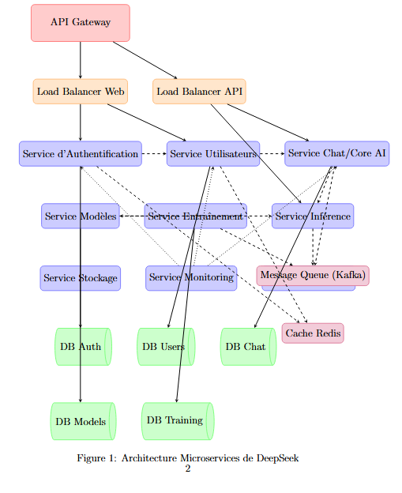
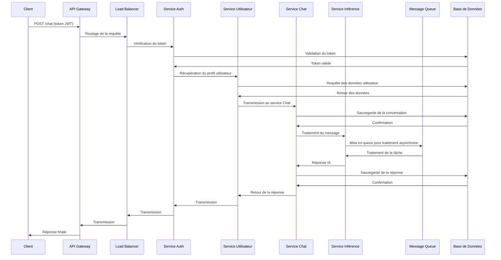

# 🧠 DeepSeek - Architecture Microservices

## Introduction
DeepSeek est une plateforme d'intelligence artificielle basée sur une architecture microservices moderne. Cette architecture est conçue pour garantir **scalabilité**, **résilience**, et **maintenabilité**. Chaque service a une responsabilité claire, et la communication entre services utilise des méthodes synchrones et asynchrones, assurant une performance optimale et une gestion efficace des pics de charge.

## Auteurs
- Ahmed Takieddine Ghrib
- Mariem Belhadj
- Yesmine Zhioua
- Nessim Zemzem

## 📋 Table des Matières
- [Aperçu de l'Architecture](#aperçu-de-larchitecture)
- [Composants Principaux](#composants-principaux)
- [Infrastructure de Support](#infrastructure-de-support)
- [Workflow de Traitement](#workflow-de-traitement)
- [Patterns Architecturaux](#patterns-architecturaux)
- [Considérations de Performance](#considérations-de-performance)
- [Notes Techniques](#notes-techniques)

## 🏗️ Aperçu de l'Architecture

L'architecture microservices de DeepSeek repose sur une **décomposition modulaire**, où chaque service a une fonction précise. Cela permet de faciliter l'évolution, la maintenance et la montée en charge des services.

### Diagramme d'Architecture

## 🔧 Composants Principaux

| Service | Responsabilité | Technologie |
|---------|----------------|------------|
| **API Gateway** | Point d'entrée unique, routage des requêtes | NGINX, Spring Cloud Gateway |
| **Service Auth** | Authentification JWT, sécurité | Node.js/Python, JWT, OAuth2 |
| **Service Utilisateurs** | Gestion des profils et préférences utilisateurs | Python/Go, REST APIs |
| **Service Chat/Core AI** | Traitement des conversations, NLP | Python, TensorFlow/PyTorch |
| **Service Inférence** | Exécution des modèles IA | Python, GPU acceleration |
| **Service Modèles** | Gestion des modèles de langage | Python, Model Registry |
| **Service Entraînement** | Fine-tuning et entraînement des modèles | Python, Distributed Training |

## 🏢 Infrastructure de Support

| Composant | Rôle | Technologie |
|-----------|------|------------|
| Load Balancers | Répartition de charge | HAProxy, NGINX |
| Message Queue | Communication asynchrone | Apache Kafka |
| Cache | Optimisation des performances | Redis |
| Monitoring | Collecte des métriques et logs | Prometheus, Grafana |
| Bases de Données | Persistance des données | PostgreSQL, MongoDB |

## 🔄 Workflow de Traitement

### Séquence Complète d'une Requête Chat

